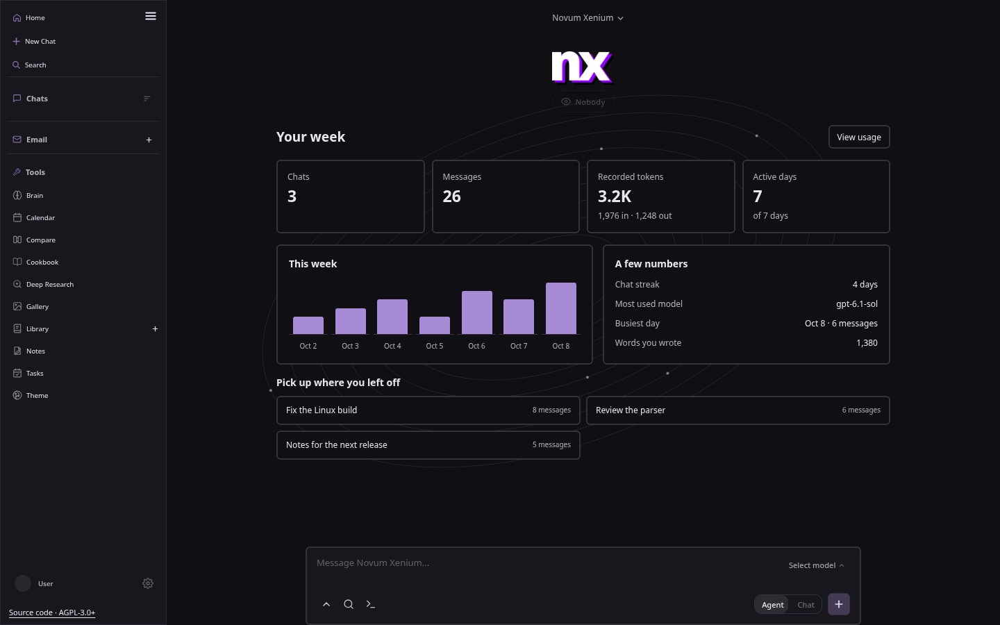
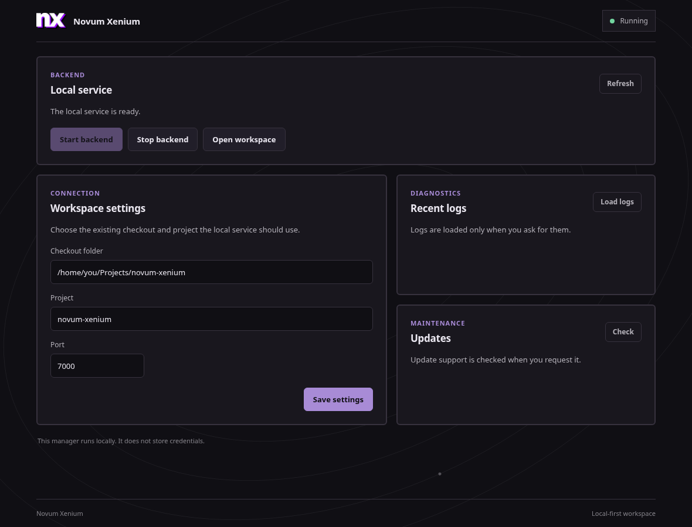

<p align="center">
  
</p>

<h1 align="center">Novum Xenium</h1>
<p align="center">A desktop home for your self-hosted agent workspace.</p>

Give it a repo. Research something. Make an image. Come back to a longer job without starting from scratch.

Novum Xenium brings your models, tools, projects and chats together. The lightweight Tauri app manages the Docker backend and opens your workspace. Prefer a browser? Same workspace, same data.

This started with [Odysseus](https://github.com/odysseus-dev/odysseus), then NX-Odysseus. We kept using it, fixing what got in the way and adding what was missing. Now it has its own desktop app, interface and way of working. The original history, credits and AGPL license stay with it.

**[Get started](#get-started)** · [Desktop app](#the-desktop-app) · [See it work](#give-it-a-real-job) · [Workflow guide](docs/nx-workflows.md) · [What changed](FORK-CHANGES.md)



<sub>The workspace, with example activity. Colours, fonts and background effects are yours to change.</sub>

## Get started

Install Git and Docker Compose, then:

```bash
git clone https://github.com/nerdrx/novum-xenium.git
cd novum-xenium
cp .env.example .env
docker compose up -d --build
```

Open **[localhost:7000](http://localhost:7000)**. Use your `ODYSSEUS_ADMIN_PASSWORD` if you set one before first boot; otherwise find the temporary password here:

```bash
docker compose logs odysseus
```

Connect a provider in **Settings**, choose **Agent** for tools, and select your workspace. Use a local model or a hosted provider, including a ChatGPT subscription. No local LLM download or image bridge needed to get going.

That's the setup: clone, copy the environment file, run Compose. Authentication is on. Ports bind to localhost by default. Your application data lives in `data/`; project files live in `data/agent_workspace/workspace/`, mounted as `/workspace` in the container.

[Full setup guide](website/setup.md) covers native installs, GPU options, Windows/macOS, HTTPS and configuration.

## The desktop app



<sub>The manager, with an example checkout. Same palette as the workspace, without the extra browser tab.</sub>

Start the backend, open the workspace, get on with it. Close the window and it stays in the tray. Reopen it without losing the page.

The app uses your system webview. It can check backend health, show logs, review updates, back up application data and help recover a failed startup. Chat, memory and tools live in the backend, so you don't end up managing a second desktop copy.

Copy an image to another app, save it with a native file dialog or open it in your default browser. Ordinary web links open there too. Desktop notifications are optional and off by default; enable them in Settings while the app is running.

Install a [desktop release](https://github.com/nerdrx/novum-xenium/releases) directly or through [NX Hub](https://github.com/nerdrx/nx-hub). The current app adopts an existing Compose checkout; it does not install Docker, WSL or Git for you.

Linux is tested locally. Windows builds run in CI; Windows runtime testing is still needed. [Desktop setup and update details](docs/desktop.md).

For development:

```bash
cd desktop
npm ci
npm run dev
```

Requires Rust and the [Tauri system dependencies](https://v2.tauri.app/start/prerequisites/).

## Built around doing the work

### A project stays a project

Persistent files, repository guidance, a compact repo map and managed Git worktrees. Save a project's checks, run them and see the result. Review a snapshot or restore included files when an edit goes sideways.

The Docker image includes ripgrep and a browser tool that starts without downloading npm packages at runtime. Sparse checkouts keep larger repositories manageable. GitHub work uses the shell and Git tools you already know.

### Long chats need more than a bigger number

Tool definitions count against the model's context, so skills and procedures load on demand. Large tool outputs can be archived, searched and opened again at the exact useful chunk. Past-chat recall opens the matching messages with timestamps and source links, rather than stopping at a vague snippet.

The context inspector shows where the space went. Retrieval helps use the context you have; it does not turn a small model window into an unlimited one.

### Know what it's doing

Clear waiting and streaming states. Explanations when a run stops. Saved progress for interrupted runs, chat-specific queues and a pause when repeated reads or failed retries go nowhere.

The home dashboard shows your week, recent chats, favourite model, chat streak and words written. Settings adds 7/30-day activity and model/token breakdowns. These come from your saved chats. Estimated tokens and missing records are labelled; subscription quotas aren't guessed.

Choose **Ask for approval**, **Approve for me** or **Full access** within your configured workspace/container. Eligible uncertain actions can go through a lightweight judge, with its reason shown.

### More than one agent, when it helps

Group conversations can continue for 20 replies, 100 replies or **Until Stop**. Shared task boards support a builder, optional read-only reviewers and your decision on whether the job is done.

Coordinated task passes run on the server, so closing the tab doesn't stop those passes. Ordinary auto-conversation still depends on the browser tab.

### Add the bits you need

Install small panels and MCP tool connections from **Settings → Modules**. Update a ZIP, review it, enable it. No rebuild for each change. Panels run in an isolated frame; tools keep their own MCP permissions. [Build a module](docs/modules.md), or start with the included Focus timer.

### Still your workspace

Charcoal panels, lavender controls and quiet orbit lines. The workspace and desktop manager now share the NX default palette. Colour, font and background controls remain, so you can make it yours or turn effects off. Custom themes currently apply to the workspace; the manager keeps the NX default. Personality names and chat titles survive a refresh; names you set yourself stay yours.

Images have their own provider settings. The optional [Codex image bridge](docs/codex-image-bridge.md) uses an existing host login for generation and attached-image edits. It needs separate setup; quality and size settings are guidance.

Odysseus also brings documents, email, notes, tasks, calendar, model comparison, deep research, MCP and a gallery. Those haven't disappeared behind the new name.

[Workflow guide](docs/nx-workflows.md) · [Full change record](FORK-CHANGES.md) · [Hermes comparison](docs/hermes-comparison.md) — Hermes itself isn't a dependency.

## Give it a real job

We gave the agent a small job in [NX Warp](https://github.com/nerdrx/nx-warp): fix the latency-summary tool crashing on compressed CSV captures.

With the ChatGPT subscription model `gpt-6.1-sol`, it cloned a sparse checkout, added a regression, confirmed the failure, fixed the script, passed all six related tests and made the commit.

**[Here's PR #74.](https://github.com/nerdrx/nx-warp/pull/74)** The tests passed again during review. GitHub's Python CI passed too.

That run also exposed a context-size lookup bug in our own harness. We fixed it and the agent finished its continuation. Testing it on actual work catches things a green unit-test run can miss.

The agent used the production loop in a saved-file harness. Review, push and PR creation used the host's existing GitHub login. Private-repository access and publishing through the normal chat UI still need testing. Other NX Warp CI failures are recorded in the PR; they weren't part of this Python fix.

### What the checks establish

Focused regressions, headless UI checks, isolated Docker starts and bounded live provider/browser runs cover recovery, workspace changes, context handling, tool calls and image discovery.

On October 8, live subscription checks completed small multi-file coding jobs, a builder/reviewer parser change, public GitHub browsing and exact-detail retrieval from archived output. Image checks fetched the generated PNG and compared dimensions with saved metadata. Browser checks also caught and fixed model selections leaking between chats.

A separate cloud run cloned this repo and fixed unbounded output capture in the coding evaluator in about 81 seconds, with one task approval. An independent offline run passed all 28 related tests before integration. An earlier rollback-preparation failure did not repeat; its cause remains unconfirmed.

These are checked examples, not a promise that every model handles every project. Test runs overlap, so we don't add them into one impressive-looking total.

[Validation record](FORK-CHANGES.md#validation) · [Remaining limits](docs/hermes-comparison.md#validation-and-limits)

## A few things to know

Hosted inference sends data to the provider you choose. Keeping the application self-hosted does not make a cloud model local.

- **Full access stays within your setup.** It doesn't mount extra host folders, enable disabled tools or override account permissions. The shell isn't an operating-system sandbox.
- **Stop has boundaries.** It cancels owned foreground process groups, background jobs and commands tracked in the persistent tmux pane. Detached or reparented processes may need separate cleanup. It cannot undo side effects.
- **Snapshots cover included workspace files.** Limits are 2,000 files, 8 MiB per file and 64 MiB total. Stop concurrent file writers before restoring. Snapshots don't undo external services, running processes or shell effects outside the workspace.
- **File safety depends on platform APIs.** Native mutations and snapshot restore need safe POSIX file APIs. Docker supplies them, including on Windows/macOS. Other native platforms may support inspection without mutation. Multi-file changes can be partial after an I/O failure; check the recovery point or workspace diff.
- **Backups are private.** They contain application data and credentials. Full backup creation needs safe file APIs and Linux procfs for SQLite snapshots, both available in the standard Docker setup. A moved or replaced source can abort a backup; retry after file moves stop. Ordinary SQLite writes are supported through its backup API.

Keep `AUTH_ENABLED=true` for a network-accessible deployment, and `LOCALHOST_BYPASS=false` outside local development. Read the [security notes](website/setup.md#security-notes) before exposing it beyond your machine.

## Help make it better

Found something odd? Show how to reproduce it, the relevant tool output and what you expected. Fresh-install checks and small fixes help too. Say when a test used simulated replies.

[Contributing](CONTRIBUTING.md) · [Roadmap](ROADMAP.md)

## Where it came from

Novum Xenium is an independent fork of [Odysseus](https://github.com/odysseus-dev/odysseus), maintained by [nerdrx](https://github.com/nerdrx). The upstream base is `main` at `934d23c0be29c9721385f34565c0ae2cbd60da04`, with NX changes recorded through October 8, 2026.

**AGPL-3.0-or-later.** Original authors and third-party notices remain in [ACKNOWLEDGMENTS.md](ACKNOWLEDGMENTS.md). See [LICENSE](LICENSE). Keep the license and notices, and provide corresponding source as required when distributing or serving modified versions.

The [upstream demo](https://odysseus-dev.github.io/odysseus/) shows the original product. This repo's [change record](FORK-CHANGES.md) describes the NX version.
